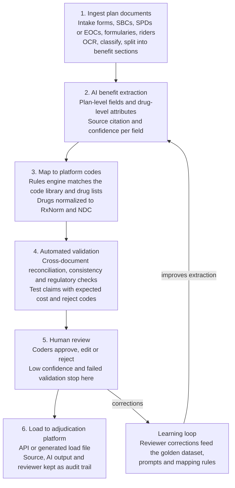

# Architecture

**AI drafts and humans decide.** Nothing loads to the adjudication platform without passing automated checks and a coder's approval.

This is the proposed design. Nothing is built yet; the [implementation plan](implementation-plan.md) covers how it gets built.

| Stage | What happens |
| --- | --- |
| 1. Ingest | Documents arrive from implementation intake; OCR, document-type classification, split into pharmacy benefit sections |
| 2. Extract | LLM turns each section into structured fields, each with a source passage and confidence score |
| 3. Map | Rules engine matches fields to the platform's code library and attaches drug lists; drug names resolve to RxNorm and NDC |
| 4. Validate | Documents reconciled against each other and against the coded plan; test claims run with expected member cost and reject codes |
| 5. Review | Coders approve, edit or reject; low-confidence fields and failed validations always stop here |
| 6. Load | Approved configuration loaded by API or generated load file; source, AI output and reviewer kept as an audit trail |

## Two layers of extraction

A pharmacy plan has two layers, and the pipeline treats them differently.

| Layer | Examples | Size | Approach |
| --- | --- | --- | --- |
| Plan level | Tier cost shares by channel, deductible, OOP maximum, days supply limits, mail and specialty rules, brand penalties | Tens of fields per plan | LLM extraction from prose and tables, one citation per field |
| Drug level | Tier, prior authorization, step therapy, and quantity limit for each drug | Thousands of rows per formulary | Table parsing of the formulary document, drug-name normalization to RxNorm, then matching to a standard drug list with client overrides flagged |

In production most plans attach a standard formulary by list ID, so the drug-level task is usually to identify the right list and surface the client's exceptions, not to rebuild the formulary.

## Test-claim simulator

The prototype has no adjudication platform to test against, so it includes a rules-based simulator that follows the same sequence a real claim does: eligibility, network, drug coverage, edits, pricing, cost share, accumulators. It returns either member cost and plan paid, or an NCPDP reject code. In production the simulator's expected results are compared with real results from the platform's test region.

## Proposed services by stage

The stack mirrors the medical benefit coding prototype so that both products share infrastructure and review tooling.

| Stage | Prototype | Production |
| --- | --- | --- |
| Document store | Cloud object storage holding public plan documents and answer keys | Client documents in the approved, encrypted environment |
| 1. Ingest | OCR and layout service; rule-based classification and section splitting | Same, plus intake-form templates per client |
| 2. Extract | Enterprise LLM with structured JSON output | Same model family under a BAA, versions pinned |
| 3. Map | Placeholder code library in a lookup table; RxNorm and FDA NDC Directory for drug identity | Client code library and list IDs; licensed drug compendium (Medi-Span or First Databank) |
| 4. Validate | Reconciliation rules, test-claim simulator, LLM judge | Plus test claims in the platform test region and regulatory rule sets |
| 5. Review | Lightweight web review screen with decisions and audit trail stored | Work queue, roles, SSO, reporting dashboard |
| 6. Load | Not built | API or load file to the adjudication platform |

See the [pharmacy coding process](pharmacy-coding-process.md) for the domain background and the [implementation plan](implementation-plan.md) for delivery phases, compliance, testing, and success metrics.
