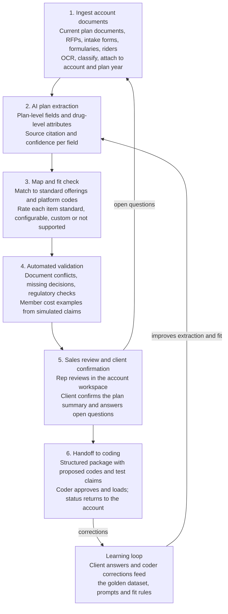

# Architecture

**AI drafts, sales confirms, coders approve.** Nothing goes to a client without a rep's review, and nothing loads to the adjudication platform without a coder's approval.

This is the proposed design. Nothing is built yet; the [implementation plan](implementation-plan.md) covers how it gets built.

## What the product is

An account workspace for sales and account management. A rep opens an account, adds its plan documents, and gets a structured, plain-language view of each plan: what the client has or wants, how it fits what the platform can administer, what is still undecided, and what changes for members. When the client confirms, the same data becomes a ready-to-code handoff package for the coding team.

The coding pipeline still sits underneath. Sales never sees platform codes, but every plan is mapped to them so that the fit check is real and the handoff is complete.

| Stage | What happens | Who sees it |
| --- | --- | --- |
| 1. Ingest | Documents are uploaded to an account and plan year; OCR, document-type classification, split into pharmacy benefit sections | Sales |
| 2. Extract | LLM turns each section into structured fields, each with a source passage and confidence score | Sales |
| 3. Map and fit check | Fields are matched to standard offerings and to the platform's code library; each is rated for how easily it can be administered | Sales sees the fit rating; coders see the codes |
| 4. Validate | Documents reconciled against each other; undecided items listed; regulatory checks run; simulated claims produce member cost examples | Sales |
| 5. Review and confirm | Rep reviews, resolves open questions with the client, and sends a plan summary for confirmation | Sales and client |
| 6. Handoff | Confirmed plan becomes a coding package; a coder approves and loads it; implementation status flows back to the account | Coders, then sales |

## Account workspace

The workspace is organized by account, then plan, then plan year.

| View | What the rep gets | Typical use |
| --- | --- | --- |
| Account overview | Every plan on the account, its status, effective date, and open items | Preparing for a client meeting |
| Plan summary | Plain-language benefit summary with a source citation for every value | Confirming understanding with the client |
| Fit report | Each requested feature rated standard, configurable, custom, or not supported, with the reason | Setting expectations before the proposal goes out |
| Open questions | Missing decisions and conflicts between documents, phrased as questions for the client | Closing gaps at the point of sale, not during coding |
| Plan comparison | Side by side: current plan against proposed, one option against another, or this year against next | Finalist presentations and renewals |
| Drug lookup and disruption | Tier and edits for any drug; which commonly used drugs change tier, gain an edit, or lose coverage | Answering "what happens to my members" |
| Member cost examples | What a member pays in standard scenarios under each plan option | Explaining the design in concrete terms |
| Handoff and status | Confirmation record, coding package, and implementation progress | Tracking the account to go-live |

## Fit ratings

The fit check is what turns a document reader into a sales tool. Every extracted feature gets one rating.

| Rating | Meaning | What the rep does |
| --- | --- | --- |
| Standard | Matches a standard offering exactly | Nothing; it can be promised |
| Configurable | Supported by setting existing parameters | Nothing; noted for coding |
| Custom | Possible only with a custom build, list, or manual process | Flag cost and lead time; get approval before committing |
| Not supported | The platform cannot administer it as written | Offer the nearest supported alternative |
| Unclear | The documents do not say enough to decide | Ask the client the generated question |

Fit rules are owned by the coding and clinical teams, not by sales, and every rating shows the rule behind it.

## Two layers of extraction

A pharmacy plan has two layers, and the pipeline treats them differently.

| Layer | Examples | Size | Approach |
| --- | --- | --- | --- |
| Plan level | Tier cost shares by channel, deductible, OOP maximum, days supply limits, mail and specialty rules, brand penalties | Tens of fields per plan | LLM extraction from prose and tables, one citation per field |
| Drug level | Tier, prior authorization, step therapy, and quantity limit for each drug | Thousands of rows per formulary | Table parsing of the formulary document, drug-name normalization to RxNorm, then matching to a standard formulary with differences flagged |

For a prospect, the drug-level task is to compare the incumbent formulary with the proposed one and report what changes. For an existing account, it is to surface client-specific exceptions.

## Member cost simulator

A rules-based simulator follows the sequence a real claim does: eligibility, network, drug coverage, edits, pricing, cost share, accumulators. It returns either member cost and plan paid, or a reject reason. It serves two purposes:

- **For sales:** member cost examples and plan comparisons, shown in plain language.
- **For coding:** the same scenarios become test claims with expected results in the handoff package.

Simulator output is illustrative and is labeled as such. It is not a quote or a claims guarantee.

## Proposed services by stage

The stack mirrors the medical benefit coding prototype so that both products share infrastructure.

| Stage | Prototype | Production |
| --- | --- | --- |
| Accounts and access | Sample accounts in a simple store | CRM integration for accounts, opportunities, and ownership; SSO; access limited to a rep's own accounts |
| Document store | Cloud object storage holding public plan documents and answer keys | Client and prospect documents in the approved, encrypted environment |
| 1. Ingest | OCR and layout service; rule-based classification and section splitting | Same, plus RFP and intake-form templates |
| 2. Extract | Enterprise LLM with structured JSON output | Same model family under a BAA, versions pinned |
| 3. Map and fit | Placeholder catalog of standard offerings and placeholder code table; RxNorm and FDA NDC Directory for drug identity | The firm's standard offering catalog, code library, and list IDs; licensed drug compendium |
| 4. Validate | Conflict and completeness rules, regulatory checks, member cost simulator, LLM judge | Plus rule sets for the launch line of business |
| 5. Review and confirm | Web account workspace; exportable plan summary | Plus client confirmation record, comparison exports, and CRM status updates |
| 6. Handoff | Downloadable coding package | Delivery into the coding team's intake queue with coder approval and status return; direct platform load is a later release |

See the [pharmacy coding process](pharmacy-coding-process.md) for the domain background and the [implementation plan](implementation-plan.md) for delivery phases, compliance, testing, and success metrics.
