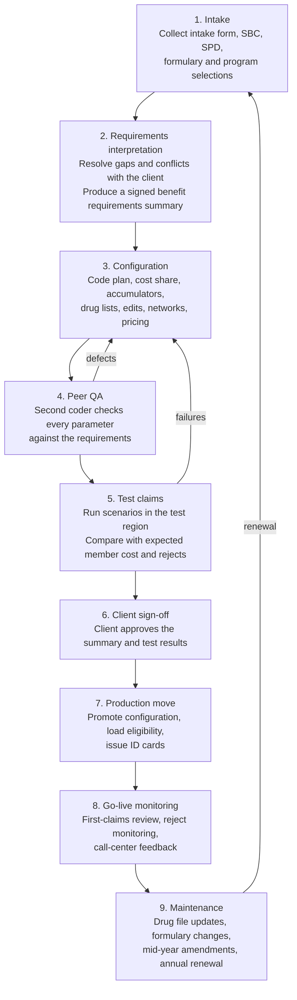
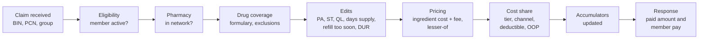

# The Pharmacy Benefit Coding Process

Pharmacy benefit coding is the work of translating a sold prescription-drug plan into the parameters of a claims adjudication platform, so that every claim submitted at a pharmacy counter pays exactly as the plan promises.

This document describes how that work is done today, what gets coded, the code sets and standards involved, and where it goes wrong. It is the domain reference for the [architecture](architecture.md) and the [implementation plan](implementation-plan.md).

## Contents

- [Why pharmacy coding is its own discipline](#why-pharmacy-coding-is-its-own-discipline)
- [Who is involved](#who-is-involved)
- [Source documents](#source-documents)
- [End-to-end process](#end-to-end-process)
- [What gets coded](#what-gets-coded)
- [Code sets and identifiers](#code-sets-and-identifiers)
- [How a claim adjudicates](#how-a-claim-adjudicates)
- [Test claims](#test-claims)
- [Lines of business](#lines-of-business)
- [Ongoing maintenance](#ongoing-maintenance)
- [Common errors and their cost](#common-errors-and-their-cost)
- [Where automation fits](#where-automation-fits)
- [Glossary](#glossary)

## Why pharmacy coding is its own discipline

Pharmacy coding shares its goal with medical benefit coding but differs in ways that change how it must be automated.

| | Medical benefit coding | Pharmacy benefit coding |
| --- | --- | --- |
| Adjudication | Batch, days after the service | Real time, in seconds, while the member waits at the counter |
| Unit of coverage | Service category (office visit, imaging, inpatient) | Individual drug product (NDC), grouped by drug lists |
| Error visibility | Found on an EOB weeks later | Found immediately: wrong copay or a rejected claim at the counter |
| Volume of rules | Tens of benefit categories per plan | Plan rules plus tens of thousands of drug-level attributes |
| Change frequency | Mostly annual | Drug files change weekly; formularies change monthly or quarterly |
| Pricing | Fee schedules, coded separately | Network pricing is coded alongside the benefit and affects member cost directly |
| Claim standard | X12 837 | NCPDP Telecommunication Standard |

Two consequences follow. A pharmacy plan has a **plan-level** layer (cost sharing, accumulators, channel rules) and a **drug-level** layer (which tier each drug sits on and which edits apply to it), and both must be right. And because adjudication is immediate, a coding error reaches members on day one rather than after a claims cycle.

## Who is involved

| Role | Responsibility |
| --- | --- |
| Sales / account management | Sells the plan design, gathers client intent, owns the client relationship |
| Implementation manager | Runs the new-client or renewal timeline and collects the intake documents |
| Benefit analyst (requirements) | Interprets client intent into unambiguous benefit requirements |
| Benefit coder (configuration) | Enters plan, drug-list, and pricing parameters into the adjudication platform |
| Quality reviewer (peer QA) | Checks coded parameters against requirements, independent of the coder |
| Test analyst | Builds and runs test claims, compares results with expected outcomes |
| Clinical / formulary team | Maintains formularies, drug lists, and utilization management criteria |
| Pricing / network team | Maintains pharmacy networks, contracted rates, and MAC lists |
| Eligibility team | Loads members and group structure; assigns BIN, PCN, and group numbers |
| Client (plan sponsor) | Signs off on the benefit summary and test results before go-live |

In smaller organizations one person covers several of these roles, which removes the independence that peer QA relies on.

## Source documents

Coders work from several documents that often disagree with one another. Resolving those disagreements is a large part of the job.

| Document | What it supplies | Typical problems |
| --- | --- | --- |
| Benefit intake form (plan design document, benefit implementation form) | The client's selected options, usually a long questionnaire | Blank answers, contradictory selections, free-text exceptions |
| Summary of Benefits and Coverage (SBC) | Member-facing cost sharing by tier | Too summarized to code from alone |
| Summary Plan Description (SPD) or Evidence of Coverage (EOC) | Full legal benefit language, exclusions, definitions | Long; pharmacy rules scattered across sections |
| Formulary and drug-list selections | Which formulary, which exclusion lists, which preventive list | Named by marketing name, not by system list ID |
| Clinical program selections | Prior authorization, step therapy, quantity limit, and specialty programs opted into | "Standard" package assumed but never confirmed |
| PBM contract pricing exhibit | Discounts, dispensing fees, guarantees by channel | Contract terms differ from what was loaded last year |
| Riders and amendments | Mid-year changes and client-specific exceptions | Arrive by email, never merged into the main document |
| Prior-year configuration | The current coded plan, for renewals | Carries forward old errors if copied without review |

## End-to-end process

| Step | What happens | Output |
| --- | --- | --- |
| 1. Intake | Implementation manager gathers documents and confirms the effective date | Complete document set |
| 2. Requirements interpretation | Analyst reads everything, lists open questions, and gets written answers from the client | Signed benefit requirements summary |
| 3. Configuration | Coder builds or clones the plan in the platform and attaches drug lists, edits, networks, and pricing | Coded plan in the test region |
| 4. Peer QA | A second coder compares each coded parameter with the requirements | QA checklist and defect log |
| 5. Test claims | Test analyst submits scenario claims and compares results with expected values | Test results package |
| 6. Client sign-off | Client reviews the summary and test results | Written approval |
| 7. Production move | Configuration is promoted; eligibility loaded; ID cards produced with BIN, PCN, and group | Live plan |
| 8. Go-live monitoring | First paid and rejected claims are reviewed against expectations for the first days and weeks | Issue log and corrections |
| 9. Maintenance | Continuous updates until the next renewal restarts the cycle | Change records |

A standard new group commonly takes several weeks from complete intake to go-live. Most of the elapsed time is spent in steps 2 through 5, and most rework comes from questions that should have been closed in step 2.

## What gets coded

### Plan structure and eligibility hierarchy

- **Hierarchy.** Platforms organize plans in levels, commonly carrier, account, and group. A benefit can be set at one level and overridden lower down, so the coder must know which level each rule belongs at.
- **Routing identifiers.** BIN (also called IIN), PCN, and group number, printed on the ID card and submitted on every claim, route the claim to the right plan.
- **Effective dates.** Every parameter is date-driven. Plan-year and calendar-year accumulators behave differently at renewal.
- **Coverage tiers.** Individual and family levels, including whether family deductibles are embedded or aggregate.

### Member cost sharing

- **Tier structure.** Commonly 2 to 6 tiers: preferred generic, generic, preferred brand, non-preferred brand, specialty, and sometimes a $0 preventive tier.
- **Cost share type.** Flat copay, coinsurance, or coinsurance with a minimum and maximum per fill.
- **By channel and days supply.** Different amounts for retail 30-day, retail 90-day, mail order, and specialty pharmacy. A common pattern is a mail 90-day copay at 2 to 2.5 times the retail 30-day copay.
- **Deductible.** Separate pharmacy deductible or integrated with medical; which tiers it applies to (often waived for generics).
- **Out-of-pocket maximum.** Separate or integrated with medical; what counts toward it.
- **Lesser-of logic.** Whether the member pays the lower of the copay, the plan's contracted price, and the pharmacy's usual and customary price.
- **Brand penalties.** When a member or prescriber requests a brand with a generic available, whether the member pays the brand copay plus the cost difference, and whether that difference counts toward accumulators.

### Accumulators

- Deductible, out-of-pocket maximum, and any benefit maximums, tracked per member and per family.
- **Integration with medical.** When pharmacy and medical share a deductible or OOP maximum, accumulator files are exchanged between the PBM and the medical carrier, often daily or in near real time. High-deductible health plans depend on this.
- **Manufacturer copay assistance.** Whether coupon amounts count toward accumulators (accumulator adjustment programs) and whether copays are raised to capture assistance (maximizer programs). State laws restrict these in some markets.
- Carryover and prior-carrier credit for mid-year starts.

### Formulary and drug lists

- **Formulary selection.** Open, closed, or a named standard formulary; which drugs are covered and on which tier.
- **Exclusions.** Drug classes not covered: commonly cosmetic, weight-loss, fertility, erectile dysfunction, and over-the-counter products, each subject to client choice.
- **Preventive lists.** ACA-required $0 preventive drugs (for example contraceptives, tobacco cessation, and statins for qualifying members), and the HDHP preventive drug list that bypasses the deductible.
- **Specialty list.** Which drugs are treated as specialty, which pharmacy must dispense them, and day-supply limits.
- **Compounds, vaccines, diabetic supplies, and devices.** Each has its own coverage and pricing rules.
- **New-to-market drugs.** Covered, excluded, or blocked pending review.

Drug lists are maintained centrally and attached to plans by list ID. The coding task is to attach the right list, not to code each drug, but client-specific overrides are frequent and are a common source of errors.

### Utilization management edits

| Edit | What it does | Typical reject |
| --- | --- | --- |
| Prior authorization (PA) | Drug pays only with an approved authorization on file | 75 Prior Authorization Required |
| Step therapy (ST) | Drug pays only if claim history shows a first-line drug was tried | 75, or a plan-specific step reject |
| Quantity limit (QL) | Caps quantity per fill or per period | 76 Plan Limitations Exceeded |
| Days supply limit | Caps days supply by channel, for example 30 at retail, 90 at mail | 76 |
| Refill too soon | Blocks a refill until a set percentage of the prior fill is used | 79 Refill Too Soon |
| Age and gender limits | Restricts coverage to clinically appropriate populations | 70 or 76 |
| Drug utilization review (DUR) | Flags interactions, duplications, and high doses | 88 DUR Reject Error |
| Mandatory mail or specialty | Requires a specific channel after a set number of retail fills | Plan-specific |

### Networks and pricing

- **Networks.** Broad, narrow, or preferred retail networks; mail and specialty pharmacies; out-of-network rules and paper-claim reimbursement.
- **Price basis.** Ingredient cost is calculated from a benchmark, most often AWP minus a contracted discount for brands and a MAC list for generics, plus a dispensing fee.
- **Lesser-of pricing.** The pharmacy is paid the lowest of the contracted rate, the MAC price, and its usual and customary price.
- **Channel rates.** Separate discounts and fees for retail 30, retail 90, mail, and specialty.
- **Taxes and incentive fees** where applicable.

Pricing is usually coded by a separate team, but it determines member cost on every coinsurance and deductible-phase claim, so plan testing must cover it.

### Coordination of benefits and special populations

- Primary and secondary payer rules, and how other-payer amounts are applied.
- Medicare Part D rules for plans in that line of business.
- Subsidy, low-income, or state-program handling where the plan requires it.

## Code sets and identifiers

| Code or identifier | What it is | Used for |
| --- | --- | --- |
| NDC | National Drug Code, an 11-digit product identifier in 5-4-2 format (labeler, product, package) | Identifying the exact product on every claim |
| GPI | Medi-Span Generic Product Identifier, a 14-character hierarchical drug classification | Building drug lists at class, drug, or strength level (licensed) |
| GCN and HIC | First Databank clinical formulation and ingredient identifiers | The same purpose in platforms that use First Databank (licensed) |
| RxNorm RxCUI | National Library of Medicine normalized drug concept identifier | Public, free drug identification; used in CMS formulary files |
| Multi-source code | Brand or generic status indicator (Medi-Span M, O, N, Y) | Deciding brand versus generic cost share |
| DAW code | NCPDP Dispense As Written code, 0 to 9 | Recording why a brand was dispensed; drives brand penalties |
| BIN / IIN, PCN, group | Routing identifiers on the member ID card | Directing the claim to the correct plan |
| NPI | National Provider Identifier for pharmacy and prescriber | Network and prescriber edits |
| NCPDP reject codes | Standard reject reasons returned to the pharmacy | Communicating why a claim did not pay |
| AWP, WAC, MAC, NADAC, U&C | Price benchmarks and price points | Calculating ingredient cost |

The NCPDP Telecommunication Standard version D.0 is the HIPAA-adopted format for retail pharmacy claims. Its common transactions are B1 (billing), B2 (reversal), and B3 (rebill). A successor version, F6, has been adopted by federal rule with a multi-year transition; the compliance timeline should be confirmed during production planning.

### Common reject codes used in testing

| Code | Meaning |
| --- | --- |
| 65 | Patient Is Not Covered |
| 70 | Product/Service Not Covered |
| 75 | Prior Authorization Required |
| 76 | Plan Limitations Exceeded |
| 79 | Refill Too Soon |
| 88 | DUR Reject Error |
| 41 | Submit Bill To Other Processor Or Primary Payer |

## How a claim adjudicates

Each claim passes through the coded rules in order. A failure at any step returns a reject; otherwise the claim prices and pays, all within a few seconds.

Because the steps run in sequence, one wrong parameter early in the chain hides everything after it. A drug attached to the wrong list never reaches the cost-share logic the coder carefully tested.

## Test claims

Test claims are the proof that the coded plan behaves as intended. A sound test set covers every tier, every channel, each accumulator phase, and each edit.

| Scenario | Expected result |
| --- | --- |
| Generic, retail 30-day | Tier 1 copay |
| Preferred brand, retail 30-day | Tier 2 or 3 copay |
| Non-preferred brand, retail 30-day | Non-preferred copay or coinsurance within min and max |
| Maintenance drug, mail 90-day | Mail copay |
| Maintenance drug, retail 90-day | Retail 90 copay, or reject if not allowed |
| Specialty drug at the specialty pharmacy | Specialty cost share, 30-day limit applied |
| Specialty drug at a retail pharmacy | Reject or out-of-network cost share, per plan |
| Brand with generic available, DAW 1 and DAW 2 | Brand copay, with or without the cost-difference penalty |
| Claim during the deductible phase | Member pays full contracted price up to the deductible |
| Claim that crosses the deductible | Split between deductible and cost share |
| Claim after OOP maximum is met | $0 member cost |
| ACA preventive drug | $0, deductible bypassed |
| PA-required drug without authorization | Reject 75 |
| Quantity above the limit | Reject 76 |
| Early refill | Reject 79 |
| Excluded drug | Reject 70 |
| Out-of-network pharmacy | Reject or reduced benefit, per plan |
| Family accumulator | Family deductible and OOP met according to embedded or aggregate rules |

## Lines of business

The coding process is the same across lines of business, but the rules that constrain it differ.

| Line of business | What changes |
| --- | --- |
| Commercial self-funded | Most flexible; plan sponsor chooses nearly every option; governed mainly by ERISA and the ACA |
| Commercial fully insured | State insurance law applies: mandated benefits, cost-sharing caps such as state insulin limits, accumulator and network laws |
| Exchange (individual and small group) | Standardized metal tiers, essential health benefits, published machine-readable formularies |
| Medicare Part D | Benefit phases defined by CMS and updated yearly; formularies and plan benefit packages filed with and approved by CMS; tight limits on mid-year changes |
| Medicaid managed care | State preferred drug lists, nominal copays, state-specific carve-outs |

Annual regulatory changes, particularly the Medicare Part D benefit parameters, must be re-verified each plan year rather than carried forward.

## Ongoing maintenance

Coding does not end at go-live.

- **Drug file updates.** New NDCs arrive weekly from the drug compendium. Each must land on the right lists and tiers, or it rejects or pays at the wrong tier.
- **Formulary changes.** Tier moves, additions, and removals are published on a set schedule, with member-notice requirements for negative changes.
- **Mid-year amendments.** Clients add programs, change copays, or carve out drug classes during the year.
- **Regulatory changes.** New federal or state requirements with fixed effective dates.
- **Annual renewal.** Most commercial plans renew January 1, with a second smaller peak on July 1. The renewal season concentrates the year's coding into the fourth quarter.
- **Audits.** Clients and regulators audit paid claims against plan documents; coding errors found here lead to reprocessing and financial settlements.

## Common errors and their cost

| Error | How it happens | Consequence |
| --- | --- | --- |
| Wrong copay for a tier or channel | Mis-keyed value; mail multiplier applied incorrectly | Members over- or under-charged on every fill |
| Deductible applied to the wrong tiers | Intake form ambiguous on "generics bypass deductible" | Systematic overcharges, large reprocessing effort |
| Accumulator not integrated with medical | Integration flag or file feed missed | Members pay past their OOP maximum |
| Wrong formulary or exclusion list attached | List chosen by name, similar names confused | Covered drugs reject, or excluded drugs pay |
| Preventive list missing | Assumed to be part of the standard build | ACA non-compliance, member complaints |
| Clinical program not turned on, or turned on unrequested | "Standard package" never confirmed | Unexpected rejects, or drug spend the client did not expect |
| Days supply or channel rule wrong | Retail 90 allowed when the plan requires mail | Claims pay against plan intent |
| Effective date wrong | Renewal change dated to the wrong plan year | Old benefit pays after renewal |
| Prior-year error carried forward | Plan cloned without review | The same error repeats for another year |
| Sales promise not captured | Exception agreed verbally or by email | Client dispute after go-live |

When an error is found after go-live, the fix is not only a configuration change. Affected claims must be identified, reversed and reprocessed, members refunded or re-billed, accumulators corrected, and the client told. Performance guarantees in PBM contracts often attach financial penalties to coding accuracy and timeliness.

## Where automation fits

The steps that consume the most skilled time are the ones that depend on reading documents and comparing them: requirements interpretation, configuration, peer QA, and writing expected test results.

| Manual step | What AI assistance does | What stays human |
| --- | --- | --- |
| Reading intake forms, SBCs, and SPDs | Extracts every benefit field with the source sentence and a confidence score | Resolving true ambiguity with the client |
| Finding conflicts between documents | Compares documents field by field and lists disagreements | Deciding which document governs |
| Choosing system parameters and list IDs | Maps extracted fields to the platform's code library and drug lists | Approving unusual or client-specific mappings |
| Peer QA | Reconciles the coded plan against the source documents automatically | Reviewing flagged items |
| Writing test claims | Generates scenarios and expected results from the extracted benefit | Approving the test set and any failures |
| Go-live monitoring | Compares first live claims with expected results | Acting on exceptions |

The governing principle is that **AI drafts and humans decide**. Nothing loads to the adjudication platform without passing automated checks and a coder's approval. The pipeline that delivers this is described in [architecture.md](architecture.md), and the delivery plan in [implementation-plan.md](implementation-plan.md).

## Glossary

| Term | Meaning |
| --- | --- |
| PBM | Pharmacy benefit manager |
| NDC | National Drug Code |
| GPI | Generic Product Identifier (Medi-Span) |
| GCN | Generic Code Number (First Databank) |
| RxCUI | RxNorm concept unique identifier |
| NCPDP | National Council for Prescription Drug Programs |
| BIN / IIN | Bank or issuer identification number used to route pharmacy claims |
| PCN | Processor control number |
| DAW | Dispense as written |
| PA, ST, QL | Prior authorization, step therapy, quantity limit |
| DUR | Drug utilization review |
| AWP | Average wholesale price |
| WAC | Wholesale acquisition cost |
| MAC | Maximum allowable cost |
| NADAC | National Average Drug Acquisition Cost |
| U&C | Usual and customary price |
| SBC | Summary of Benefits and Coverage |
| SPD | Summary Plan Description |
| EOC | Evidence of Coverage |
| OOP max | Out-of-pocket maximum |
| HDHP | High-deductible health plan |
| ACA | Affordable Care Act |
| ERISA | Employee Retirement Income Security Act |
